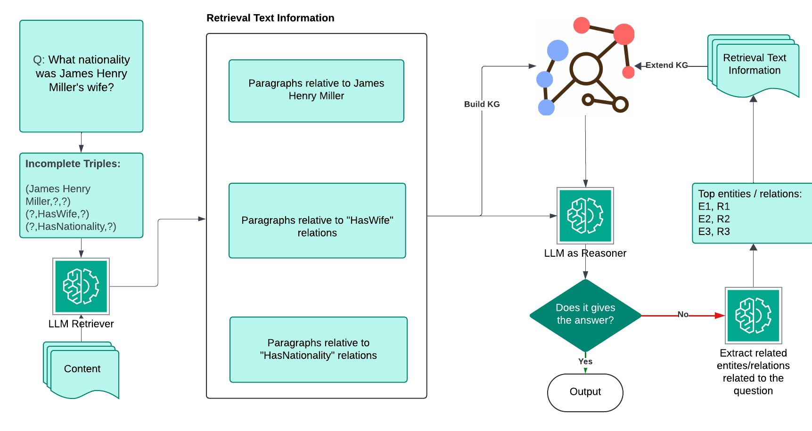

# KGEIR: Knowledge Graph-Enhanced Iterative Reasoning for Multi-Hop Question Answering

[](https://aclanthology.org/2025.r2lm-1.14/)
[](https://www.python.org/downloads/)
[](LICENSE)

Official implementation of the paper **"KGEIR: Knowledge Graph-Enhanced Iterative Reasoning for Multi-Hop Question Answering"** presented at the First Workshop on Comparative Performance Evaluation: From Rules to Language Models (R2LM) at ACL 2025.

## Overview

Multi-hop question answering requires reasoning over multiple pieces of evidence to arrive at an answer. KGEIR addresses this challenge by **dynamically constructing and refining knowledge graphs during the question answering process** to enhance multi-hop reasoning capabilities.

<p align="center">
  
</p>

### Key Features

- **Dynamic Knowledge Graph Construction**: Builds structured knowledge representations from retrieved text passages
- **Iterative Reasoning**: Identifies information gaps and retrieves additional context to refine the knowledge graph
- **Entity-Centric Reasoning**: Performs inference over graph structure to connect evidence across multiple hops
- **Gap Detection**: Automatically identifies missing information needed for complete answers

### Framework Pipeline

1. **Entity Identification**: Extract key entities from the input question
2. **Graph Construction**: Build initial knowledge graph from retrieved paragraphs
3. **Reasoning**: Perform inference over the graph structure
4. **Gap Detection**: Identify missing information needed for complete answers
5. **Iterative Refinement**: Retrieve additional context to expand and improve the graph

## Installation

```bash
# Clone the repository
git clone https://github.com/YOUR_USERNAME/KGEIR.git
cd KGEIR

# Install dependencies
pip install -r requirements.txt

# Download spaCy model
python -m spacy download en_core_web_sm
```

### Requirements

- Python 3.8+
- PyTorch 1.9+
- See `requirements.txt` for full dependencies

## Quick Start

### Basic Usage

```python
from llama_index.llms.ollama import Ollama
from kg_enhanced_mhqa import kg_enhanced_qa_pipeline

# Initialize LLM
llm = Ollama(model="llama3.3", request_timeout=600.0)

# Example question and context
question = "What is the capital of the country where the Eiffel Tower is located?"
context = [...]  # Your retrieved paragraphs

# Run KGEIR pipeline
result = kg_enhanced_qa_pipeline(
    llm=llm,
    question=question,
    context=context,
    initial_paragraphs=retrieved_paragraphs,
    question_decomposition=decomposed_questions,
    max_iterations=3
)

print(f"Answer: {result['answer']}")
```

### Running the Demo

```bash
python kg_mhqa_demo.py --question "Your multi-hop question here"
```

### Running Evaluation

```bash
# Evaluate on HotpotQA
python evaluation/evaluation_MHQA.py
```

## Project Structure

```
KGEIR/
├── kg_enhanced_mhqa.py          # Main KGEIR implementation
├── kg_enhanced_mhqa_kg.py       # KG-only variant
├── kg_reasoner.py               # Knowledge graph reasoning module
├── kg_mhqa_demo.py              # Demo script
├── run_kg_guided_rag.py         # KG-guided RAG runner
│
├── utils/                       # Core utility modules
│   ├── KG_builder.py           # Knowledge graph construction
│   ├── iterative_reasoner.py   # Iterative reasoning with gap detection
│   ├── RAG_process.py          # RAG retrieval and generation
│   └── kg_guided_rag.py        # KG-guided retrieval
│
├── prompts/                     # Prompt templates
│   └── prompt_templates.py
│
├── baselines/                   # Baseline methods for comparison
│   ├── Graph2MHQA2_1_COT.py    # Chain-of-Thought prompting
│   ├── Graph2MHQA2_1_tot.py    # Tree-of-Thought prompting
│   └── Graph2MHQA2_1_vanilla.py # Vanilla LLM baseline
│
├── evaluation/                  # Evaluation scripts
│   ├── evaluation_MHQA.py      # Main evaluation script
│   └── evaluate_MHQA.py        # Evaluation utilities
│
└── notebooks/                   # Example notebooks
    ├── Evaluation.ipynb
    └── Graph2MHQA2_1_KG_reasoning.ipynb
```

## Datasets

KGEIR is evaluated on three multi-hop QA benchmarks:

| Dataset | Description | Link |
|---------|-------------|------|
| **HotpotQA** | Multi-hop reasoning over Wikipedia | [Download](https://hotpotqa.github.io/) |
| **2WikiMultiHopQA** | Multi-hop QA requiring reasoning over 2 Wikipedia articles | [Download](https://github.com/Alab-NII/2wikimultihop) |
| **MuSiQue** | Multi-hop questions with single-hop decompositions | [Download](https://github.com/StonyBrookNLP/musique) |

Place downloaded datasets in a `dataset/` directory:
```
dataset/
├── hotpot/
│   └── hotpot_train_v1.1.json
├── 2WikiMultihopQA/
│   └── train.json
└── MuSiQue/
    └── train.json
```

## Core Components

### Knowledge Graph Construction

The `KG_builder` module extracts structured knowledge from text:

```python
from utils.KG_builder import build_rdflib_knowledge_graph

# Build KG from paragraphs
kg = build_rdflib_knowledge_graph(paragraphs)
```

### Iterative Reasoning

The `iterative_reasoner` module performs multi-hop reasoning with gap detection:

```python
from utils.iterative_reasoner import process_question_with_kg_awareness

result = process_question_with_kg_awareness(
    llm=llm,
    question=question,
    kg=knowledge_graph,
    context=context
)
```

### KG-Guided Retrieval

Retrieve additional paragraphs based on identified information gaps:

```python
from kg_enhanced_mhqa import retrieve_additional_paragraphs

new_paragraphs = retrieve_additional_paragraphs(
    llm=llm,
    context=context,
    missing_info=gaps,
    previous_paragraphs=current_paragraphs,
    k=5
)
```

## Baselines

We provide implementations of baseline methods for comparison:

| Method | Script | Description |
|--------|--------|-------------|
| **Vanilla** | `baselines/Graph2MHQA2_1_vanilla.py` | Direct LLM prompting |
| **Chain-of-Thought** | `baselines/Graph2MHQA2_1_COT.py` | Step-by-step reasoning |
| **Tree-of-Thought** | `baselines/Graph2MHQA2_1_tot.py` | Branching reasoning paths |

Run baselines:
```bash
python baselines/Graph2MHQA2_1_COT.py
python baselines/Graph2MHQA2_1_tot.py
python baselines/Graph2MHQA2_1_vanilla.py
```

## Results

KGEIR achieves competitive or superior performance compared to state-of-the-art methods. The following results are based on answer accuracy using Gemma3-27B as the backbone LLM:

### Main Results

| Method | HotpotQA | 2WikiMultiHopQA | MuSiQue |
|--------|----------|-----------------|---------|
| Vanilla LLM | 40.8% | 63.1% | 47.0% |
| Chain-of-Thought | 83.1% | 76.1% | 6.9% |
| Tree-of-Thought | 35.1% | 57.8% | 44.5% |
| **KGEIR (Ours)** | **60.5%** | **72.1%** | **34.0%** |

### Key Findings

- **Structured Knowledge Outperforms Prompting**: KGEIR's knowledge graph representation provides more reliable reasoning compared to Chain-of-Thought on complex multi-hop questions
- **Robust Performance**: KGEIR shows consistent performance across different question types and reasoning depths
- **Iterative Refinement**: The gap detection and iterative retrieval mechanism successfully identifies and fills missing information

### Ablation Study

| Variant | HotpotQA | Description |
|---------|----------|-------------|
| KGEIR (Full) | 60.5% | Complete pipeline with iterative refinement |
| w/o Iterative Refinement | 44.7% | Single-pass reasoning without gap detection |
| w/o KG Structure | 40.8% | Equivalent to vanilla RAG |

*See [paper](https://aclanthology.org/2025.r2lm-1.14/) for detailed analysis and additional experiments.*

## Configuration

Modify the LLM settings in the main scripts:

```python
from llama_index.llms.ollama import Ollama

# For local Ollama models
llm = Ollama(model="llama3.3", request_timeout=600.0, keep_alive=-1)

# Or use other LLM providers supported by LlamaIndex
```

## Citation

If you find this work useful, please cite our paper:

```bibtex
@inproceedings{sun-kazakov-2025-kgeir,
    title = "{KGEIR}: Knowledge Graph-Enhanced Iterative Reasoning for Multi-Hop Question Answering",
    author = "Sun, Tianda and Kazakov, Dimitar",
    booktitle = "Proceedings of the First Workshop on Comparative Performance Evaluation: From Rules to Language Models",
    month = sep,
    year = "2025",
    address = "Varna, Bulgaria",
    publisher = "Association for Computational Linguistics",
    url = "https://aclanthology.org/2025.r2lm-1.14/",
}
```

## License

This project is licensed under the MIT License - see the [LICENSE](LICENSE) file for details.

## Acknowledgments

- Thanks to the creators of HotpotQA, 2WikiMultiHopQA, and MuSiQue datasets
- Built with [LlamaIndex](https://github.com/run-llama/llama_index) and [RDFLib](https://github.com/RDFLib/rdflib)

## Contact

For questions or issues, please open a GitHub issue or contact:
- Tianda Sun - [ts1201@york.ac.uk](mailto:ts1201@york.ac.uk)
- Dimitar Kazakov - [dimitar.kazakov@york.ac.uk](mailto:dimitar.kazakov@york.ac.uk)
